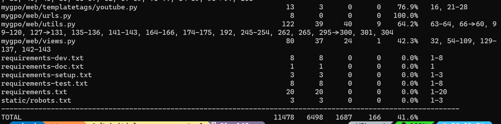
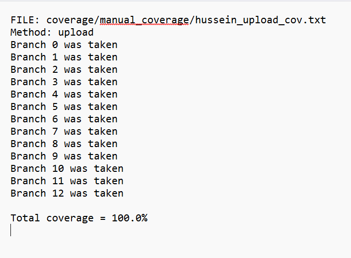
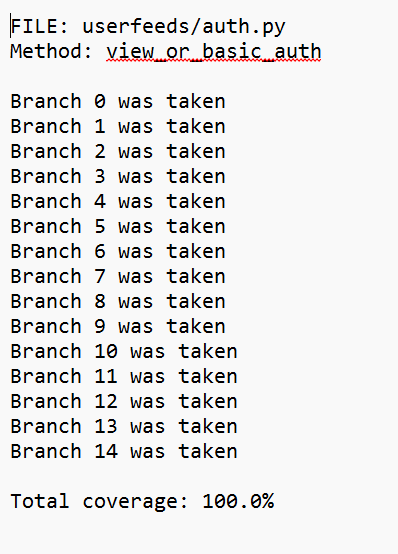
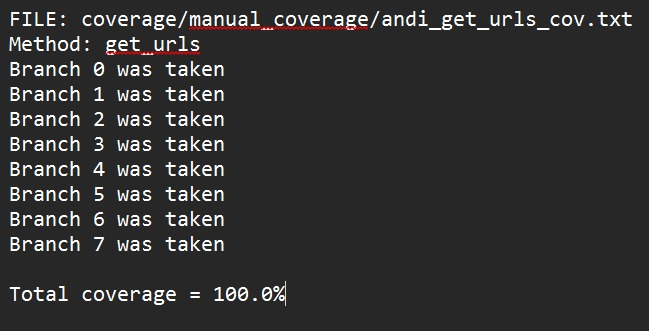
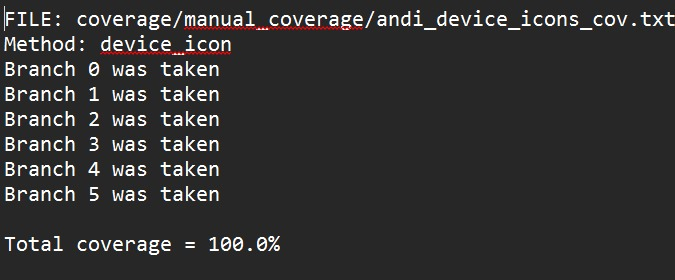
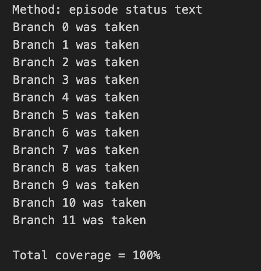
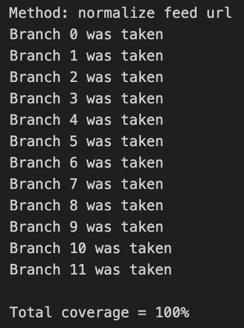
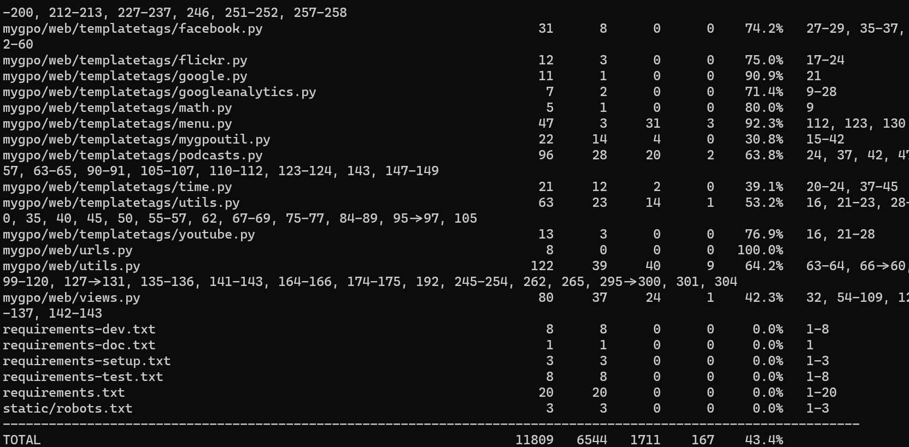

# Report for Assignment 1

## Project chosen

Name: **mygpo**

URL: (https://github.com/gpodder/mygpo)

Number of lines of code and the tool used to count it:
**17,266**, counted using **lizard**

Programming language: **Python**

## Coverage measurement

### Existing tool

Since our project was written in python, we used **Coverage.py** to measure the coverage of the tests.

To run the tool, the following steps were taken:

1. Navigate to the cloned **mygpo** directory
2. Run the command: `coverage run --source="*" manage.py test` replacing the `*` with the desired directory (**mygp** if running over the entire project)
3. Run the command `coverage report` to produce a report on the terminal
4. (Optional) Run the command `coverage html` to produce an **html** version of the report

### Your own coverage tool

### Hussein Sarrar

#### Function 1: **upload** in **mygpo/api/legacy.py**

[Link to commit](https://github.com/gpodder/mygpo/commit/139b0d6521379a7a70e2e83b8d06b106f4c5b096)

**NOTE:** This commit is not the first commit showing the instrumentation, rather a second commit where I expanded coverage to take invisible else clauses into account.

The function was not being tested initially, and so produced no coverage results.and had 0% coverage

#### Function 2: **view_or_basicauth** in **mygpo/userfeeds/auth.py**

[Link to commit](https://github.com/gpodder/mygpo/commit/139b0d6521379a7a70e2e83b8d06b106f4c5b096)

**NOTE:** This commit is not the first commit showing the instrumentation, rather a second commit where I expanded coverage to take invisible else clauses into account.

The function was not being tested initially, and so produced no coverage results and had 0% coverage.

### Mohamed Hussain Shareef

#### Function 1: episode_status_icon in mygpo/web/templatetags/episodes.py

[Link to commit summary (BRANCH INSTRUMENTATION)](https://github.com/HusseinSarrar05/mygpo/pull/4/files#diff-761057704aefb718d8b927b536b11bd3d11541447d027a3d93449dae55e132e4)

The function had 0% coverage initially, so it produced no coverage results. Check below to see the coverage results after:
[Link to commit summary (COVERAGE RESULTS)](https://github.com/HusseinSarrar05/mygpo/pull/4/files#diff-761057704aefb718d8b927b536b11bd3d11541447d027a3d93449dae55e132e4)

Screenshot:

#### Function 2: EpisodeUpdater in mygpo/data/feeddownloader.py

[Link to commit summary (BRANCH INSTRUMENTATION)](https://github.com/HusseinSarrar05/mygpo/pull/4/files#diff-8c15d9291fda719b8caedcd25c94db3dbdbe1e36f76d43b9254249b58ea5f321)

The function had 0% coverage initially, so it produced no coverage results. Check below to see the coverage results after:
[Link to commit summary (COVERAGE RESULTS)](https://github.com/HusseinSarrar05/mygpo/pull/4/files#diff-f84ea5bd798f6c5f42ba9c634e519bbf37b0999055f209097f5f711561868bde)

Screenshot:

### Andreas Stolle

#### Function 1: get_urls in mygpo/api/advanced/episode.py

[Link to get_urls instrumentation](https://github.com/gpodder/mygpo/commit/bad42f07c50ad5ec22a7ab30e8a629a6a269d1d8)

There was no test provided by the original repository for the get_urls function. 
Thus, we can state the branch coverage was 0%.

#### Function 2: device_icon in **mygpo/web/templatetags/devices.py**

[Link to device_icon instrumentation](https://github.com/gpodder/mygpo/commit/b04eecb0e85f97a632e813147dac6ea2184b99c5)

There was no test provided by the original repository for the get_urls function. 
Thus, we can state the branch coverage was 0%.

### Samuel Power

#### Function 1: **episode_status_text** in mgpo/web/templatetags/episodes.py**

[Link to instrumentation commit](https://github.com/HusseinSarrar05/mygpo/pull/2/commits/f37429538b74f6150816648add1cf76069633674) for episode_status_text.

No tests were made for this function, and so it had 0% coverage and produced no coverage results initially.

#### Function 2: **normalize_feed_url** in **mygpo/utils.py**

[Link to instrumentation commit](https://github.com/HusseinSarrar05/mygpo/pull/2/commits/abe88b28fa97057b048514f2108b77963d9ec591) for normalize_feed_urls.

No tests were made for this function, and so it had 0% coverage and produced no coverage results initially.

## Coverage improvement

All coverage results were written to **txt** files

### Individual tests

### Hussein Sarrar

#### Test for function 1: upload

[Link to commit showing test](https://github.com/gpodder/mygpo/commit/5a18f0d8c9f5c85d0d519091a200da57b221970d),
Test can be found in **mygpo/api/tests.py** file.

The function was not being tested at all and had 0% coverage.

Coverage results:

After creating a new test for it, the coverage achieved was **100%**. All different logical paths through the function were taken, and the results were asserted. Trials were run with incomplete data, data that guaranted no changes, and data that did.

#### Test for function 2: view_or_basicauth

[Link to commit showing test](https://github.com/gpodder/mygpo/commit/603b2ef66aab55ada2b820db571e33ad51acb23b),
Test can be found in **mygpo/userfeeds/tests.py** file.

The function was not being tested at all and had 0% coverage.

Coverage results:

After creating a new test for it, the coverage achieved was **100%**. All different logical paths through the function were taken, and the results were asserted. Different authentication headers were tried, along with valid, invlaid, and incorrect validation credentials.

### Mohamed Hussain Shareef

#### Test for Function 1: episode_status_icon in mygpo/web/templatetags/episodes.py

[Link to commit summary with tests](https://github.com/HusseinSarrar05/mygpo/pull/4/files#diff-9b165d03e2d7ee3b32727f3c6a51236d18e30bb4a53aef2b9dd12ecb0ec6578e)

This can be found in **mygpo/web/tests.py**. 
The function previously had no testing, and had 0% coverage. 
After creating new tests for it, 100% coverage was achieved. All branches were taken, and we did different testing scenarios to check for proper statuy icon behaviour. 
See previous section for the coverage results produced after testing. 

#### Test for Function 2: EpisodeUpdater in mygpo/data/feeddownloader.py

This can be found in **mygpo/data/tests.py**

[Link to commit summary with tests](https://github.com/HusseinSarrar05/mygpo/pull/4/files#diff-9866422a779a64f57d1d1143dd58fb30646268710cc5ac465c1b65270b58487c)
The function previously had no testing, and had 0% coverage. 
After creating new tests for it, 100% coverage was achieved. All branches were taken, had to test if it would properly mark episodes as outdated and have proper updating functionality using mock episode objects and assertions. 
See previous section for the coverage results produced after testing.

### Andreas Stolle

#### Test for function 1: get_urls in mygpo/api/advanced/episode.py
After creating the tests, 100% coverage was achieved, as all branches were taken.

[Link to GetUrlsTest](https://github.com/gpodder/mygpo/commit/818b2e6e0d35c8144081c7a64fc2bc97de12b629)

Coverage results:

After creating the new tests, 100% branch coverage was achieved.

#### Test for function 2: device_icon in mygpo/web/templatetags/devices.py 

After creating the tests, 100% coverage was achieved, as all branches were taken.

[Link to DeviceTest](https://github.com/gpodder/mygpo/commit/e6cd09e92d297a1d5400a40d6ca14dd6490b939f)

Coverage results:

After creating the new tests, 100% branch coverage was achieved.

### Samuel Power

#### Function 1: **episode_status_text** in **mgpo/web/templatetags/episodes.py**

[Link to commit](https://github.com/HusseinSarrar05/mygpo/pull/2/commits/e95c9851dc64d98c2d3ad6741954784b647a7085)

Coverage results:

100% branch coverage was achieved after creating the new test.

#### Function 2: **normalize_feed_url** in **mygpo/utils.py**

[Link to commit](https://github.com/HusseinSarrar05/mygpo/pull/2/commits/cbe2a50c129e3f13be3dfd0dfc3d287acd0cdb24)

**NOTE:** Please note that the function was duplicated for testing purposes, and renamed to normalize_url. This was done because python does not support function overloading, which would have otherwise been necessary due to the functions high number of dependents contained in other files. 

Coverage results:

100% branch coverage was achieved after creating the new test.

### Overall

#### Initial coverage

#### Coverage after creating new tests

#### Result

Achieved an increase of **1.8%** in the **total** coverage of the tests on the project.

## Statement of individual contributions

### Hussein Sarrar
* Forked github repository and handled creating branches
* Instrumented the **upload** and **view_or_basicauth** functions
* Created new test cases for both functions, achieving 100% coverage on both
* Enured all tests function correctly upon merging

### Mohamed Hussain Sharif
* Counted lines of mygpo using **lizard**
* Instrumented the **episode_status_icon** and **EpisodeUpdater.mark_outdated** functions
* Created new test cases for both functions, achieving 100% coverage on both
* Ran **Coverage.py** on repository before and after merging

### Samuel Power
* Aided in choosing the project and ensuring it was up to requirements
* Instrumented the **episode_status_text** and **normalize_feed_url** functions
* Created new test cases for both functions, achieving 100% coverage on both

### Andreas Stolle
* Aided in choosing the project and ensuring it was up to requirements
* Instrumented the **get_urls** and **device_icons** functions
* Created new test cases for both functions, achieving 100% coverage on both

